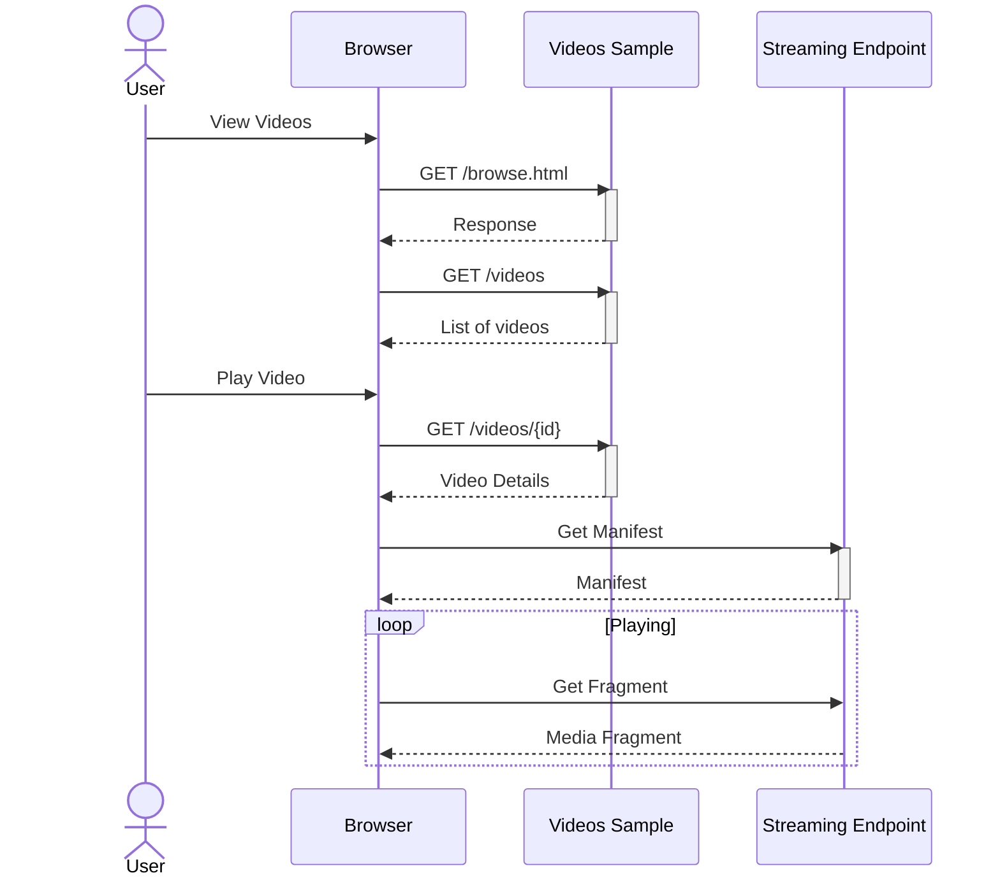

# Simple Video Streaming

This sample contains a .NET web application for streaming videos. In this version of the sample, anyone can browse and play videos -- no authentication is implemented.

## Features

This project framework provides the following features:

* A web application for browsing
* Video playback using Azure Media Player
* Sample code for uploading and configuring Media Services to stream videos

## Getting Started

### Prerequisites
- [Azure CLI](https://docs.microsoft.com/en-us/cli/azure/install-azure-cli)
- [.NET 6](https://dotnet.microsoft.com/en-us/learn/dotnet/hello-world-tutorial/install)
- [Visual Studio](https://visualstudio.microsoft.com/) or [Visual Studio Code](https://code.visualstudio.com/)
- An [Azure Subscription](https://azure.microsoft.com/)

### Resource Creation

To encode and stream media using Azure Media Services, a Media Services account is required. The `MediaServices.bicep` ARM template
can be used to create a Media Services account. The template also creates an Azure Storage account for use with the Media Services
account, and Managed Identity to allow the Media Services account to access the storage account.

The template creates resources under the Media Services account for encoding and streaming media:
|Name | Type | Purpose|
|-----|------|--------|
|VideosSampleContentAwareEncodingTransform|Transform|A Media Services transform, used when encoding Media Files. The transform uses [content-aware](https://docs.microsoft.com/azure/media-services/latest/encode-content-aware-concept) encoding to create assets that can be streamed on a wide range of devices.|
|VideosSampleNoEncryptionStreamingPolicy|Streaming Policy|A streaming policy to allow media assets to be streamed without encryption.|

Run the following commands to deploy resources to an Azure subscription:

```console
cd 1-VideosSample-Public

az login

az account set --subscription <subscription-id>

az group create --location westus --name <resource-group-name>

az deployment group create `
  --resource-group <resource-group-name> `
  --template-file .\MediaServices.bicep `
  --parameters baseName=<name> `
  --query "properties.outputs"
```

### Preparing Videos

Media Services can encode media content so it can be streamed using a wide variety of devices. The AddVideoTool included in this sample will:
- Prepare a media file for streaming, the source content may come from a local mp4 file or a URL
  - Existing Media Services Assets may also be used
- Create a Streaming Locator for the video
- Build streaming and thumbnail URLs for the video
- Add the video to an index file

The AddVideoTool uses a Transform and a Streaming Policy created by the deployment template.

To add a video using a local mp4 file:
```console
dotnet run --project ..\AddVideoTool `
  /SubscriptionId <subscription-id> `
  /ResourceGroup <resource-group-name> `
  /AccountName <media-services-account-name> `
  /Transform VideosSampleContentAwareEncodingTransform `
  /StreamingPolicy VideosSampleNoEncryptionStreamingPolicy `
  /Title "All about cars" `
  /SourceFile cars.mp4 `
  /Asset Cars
```

To add a video from a URL:
```console
dotnet run --project ..\AddVideoTool `
  /SubscriptionId <subscription-id> `
  /ResourceGroup <resource-group-name> `
  /AccountName <media-services-account-name> `
  /Transform VideosSampleContentAwareEncodingTransform `
  /StreamingPolicy VideosSampleNoEncryptionStreamingPolicy `
  /Title "All about cars" `
  /SourceFile cars.mp4 `
  /Asset Cars
```

To use an existing Media Services asset (without encoding):
```console
dotnet run --project ..\AddVideoTool `
  /SubscriptionId <subscription-id> `
  /ResourceGroup <resource-group-name> `
  /AccountName <media-services-account-name> `
  /StreamingPolicy VideosSampleNoEncryptionStreamingPolicy `
  /Title "All about cars" `
  /Asset Cars
```

The AddVideoTool may also be configured using the `..\AddVideoTool\appsettings.json` file.

### Starting the default Streaming Endpoint

Streaming Endpoints are used serve media content to viewers. The Streaming Endpoint must be started before it can be used.

```console
az ams streaming-endpoint start `
  --resource-group <resource-group-name> `
  --account-name <media-services-account-name> `
  --name default 
```

### Building the Web App

The VideoSample project contains a simple web application for browsing and watching videos. The application uses
the `index.json` file create by the `AddVideoTool`.

```console
dotnet run --project VideosSample
```

While the sample is running, open `https://localhost:7150/` in a browser to access the application.

### Details



When a user browses videos, the Video Sample application returns all the videos in the `index.json` file. To play
a video, the application passes the manifest URL for the video to the media player. The player will then read the
media fragments to play the video.