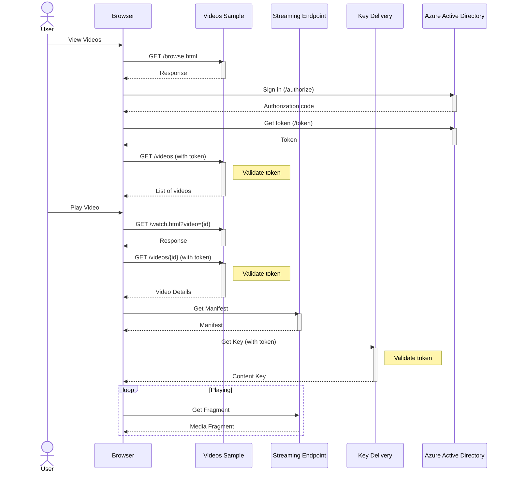

# Video Streaming with Basic Authorization

This sample contains a .NET web application for streaming videos. In this version of the sample, users must login to view videos.

## Features

This project framework provides the following features:

* A web application for browsing
* Video playback using Azure Media Player
* Sample code for uploading and configuring Media Services to stream videos
* Basic authentication and authorization

## Getting Started

### Prerequisites
- [Azure CLI](https://docs.microsoft.com/en-us/cli/azure/install-azure-cli)
- [.NET 6](https://dotnet.microsoft.com/en-us/learn/dotnet/hello-world-tutorial/install)
- [Visual Studio](https://visualstudio.microsoft.com/) or [Visual Studio Code](https://code.visualstudio.com/)
- An [Azure Subscription](https://azure.microsoft.com/)

### Azure Active Directory Configuration

```console
cd 2-VideosSample-BasicAuth

dotnet run --project AadSetup `
  /TenantId <tenant-id> `
  /TenantDomain "<tenant-domain>" `
  /ApplicationDisplayName "Video Sample" `
  /ApplicationName "video-sample"
```

### Resource Creation

To encode and stream media using Azure Media Services, a Media Services account is required. The `MediaServices.bicep` ARM template
can be used to create a Media Services account. The template also creates an Azure Storage account for use with the Media Services
account, and Managed Identity to allow the Media Services account to access the storage account.

The template creates resources under the Media Services account for encoding and streaming media:
|Name | Type | Purpose|
|-----|------|--------|
|VideosSampleContentAwareEncodingTransform|Transform|A Media Services transform, used when encoding Media Files. The transform uses [content-aware](https://docs.microsoft.com/azure/media-services/latest/encode-content-aware-concept) encoding to create assets that can be streamed on a wide range of devices.|
|VideosSampleEncryptionContentKeyPolicy|Content Key Policy|A Content Key Policy that defines how requests for media keys should be processed when streaming encrypted media.|
|VideosSampleEncryptionStreamingPolicy|Streaming Policy|A Streaming Policy to that defines how encrypted media should be streamed.|
|VideosSampleDrmContentKeyPolicy|Content Key Policy|A Content Key Policy that defines how requests for media keys should be processed when streaming encrypted media with DRM.|
|VideosSampleDrmStreamingPolicy|Streaming Policy|A Streaming Policy to that defines how encrypted media with DRM should be streamed.|

Run the following commands to deploy resources to an Azure subscription:

```console
az login

az account set --subscription <subscription-id>

az group create --location westus --name <resource-group-name>

az deployment group create `
  --resource-group <resource-group-name> `
  --template-file .\MediaServices.bicep `
  --parameters baseName=<name> tenantId=<tenant-id> apiApplicationClientId=<client-id> `
  --query "properties.outputs"
```

### Preparing Videos

Media Services can encode media content so it can be streamed using a wide variety of devices. The AddVideoTool included in this sample will:
- Prepare a media file for streaming, the source content may come from a local mp4 file or a URL
  - Existing Media Services Assets may also be used
- Create a Streaming Locator for the video
- Build streaming and thumbnail URLs for the video
- Add the video to an index file

The AddVideoTool uses a Transform and a Streaming Policy created by the deployment template.

To add a video using a local mp4 file:
```console
dotnet run --project ..\AddVideoTool `
  /SubscriptionId <subscription-id> `
  /ResourceGroup <resource-group-name> `
  /AccountName <media-services-account-name> `
  /Transform VideosSampleContentAwareEncodingTransform `
  /StreamingPolicy VideosSampleEncryptionStreamingPolicy `
  /Title "All about cars" `
  /SourceFile cars.mp4 `
  /Asset Cars
```

To add a video from a URL:
```console
dotnet run --project ..\AddVideoTool `
  /SubscriptionId <subscription-id> `
  /ResourceGroup <resource-group-name> `
  /AccountName <media-services-account-name> `
  /Transform VideosSampleContentAwareEncodingTransform `
  /StreamingPolicy VideosSampleEncryptionStreamingPolicy `
  /Title "All about cars" `
  /SourceFile cars.mp4 `
  /Asset Cars
```

To use an existing Media Services asset (without encoding):
```console
dotnet run --project ..\AddVideoTool `
  /SubscriptionId <subscription-id> `
  /ResourceGroup <resource-group-name> `
  /AccountName <media-services-account-name> `
  /StreamingPolicy VideosSampleEncryptionStreamingPolicy `
  /Title "All about cars" `
  /Asset Cars
```

The AddVideoTool may also be configured using the `..\AddVideoTool\appsettings.json` file.

### Starting the default Streaming Endpoint

Streaming Endpoints are used serve media content to viewers. The Streaming Endpoint must be started before it can be used.

```console
az ams streaming-endpoint start `
  --resource-group <resource-group-name> `
  --account-name <media-services-account-name> `
  --name default 
```

### Building the Web App

The VideoSample project contains a simple web application for browsing and watching videos. The application uses
the `index.json` file create by the `AddVideoTool`.

Before running the application, the appsettings.json and wwwroot/js/authConfig.js files must be updated, using
the values printed by the `AadSetup` tool.

```console
dotnet run --project VideosSampleWithAuth
```

Then open `https://localhost:7150/` in a browser.

### Using DRM

To use DRM when streaming videos, the `VideosSampleDrmStreamingPolicy` Streaming Policy may be used.

```console
dotnet run --project ..\AddVideoTool `
  /SubscriptionId <subscription-id> `
  /ResourceGroup <resource-group-name> `
  /AccountName <media-services-account-name> `
  /Transform VideosSampleContentAwareEncodingTransform `
  /StreamingPolicy VideosSampleDrmStreamingPolicy `
  /Title "All about boats" `
  /SourceFile boats.mp4 `
  /Asset Boats
```

### Details



To list videos, users must sign in and request a token for the API application. When a user is signed in,
browser requests the list of videos. The service validates the user's token and returns a list of videos
from the `index.json` files created by `AddVideoTool`. When users play videos, the manifest URL is passed to
the player. The player downloads the manifest and discovers the key delivery URL. The player will send a request
to the Key Delivery server, with the previously requested token. The Key Delivery server validates the token
and returns the content key for the media.